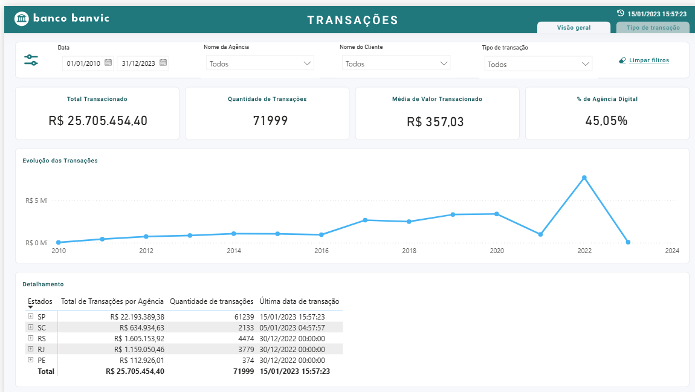

# Enterprise-Data-Warehouse-Databricks-dbt-Power-BI
#  Projeto Banvic - Analytics Engineering


## 📌 Visão Geral do Projeto
Este repositório documenta a arquitetura de dados e a modelagem analítica do **Banvic**, um projeto prático focado em resolver problemas de negócios no setor bancário. O objetivo principal é demonstrar o ciclo de vida completo dos dados, desde a ingestão bruta até a disponibilização para consumo em painéis de Business Intelligence (BI) e Analytics.

O fluxo foi construído aplicando as melhores práticas de Engenharia de Dados, utilizando processamento em nuvem e transformação via SQL modularizado.

---

## 🏗️ Arquitetura de Dados (Medallion Architecture)

O fluxo de dados foi desenhado utilizando a **Arquitetura Medalhão**, estruturando o Data Warehouse em três camadas progressivas de qualidade técnica e regras de negócio:

* **🥉 Camada Bronze (Raw):** Ingestão de dados brutos e históricos, mantendo o estado original das fontes para garantir a linhagem e auditoria.
*  **🥈 Camada prata (Staging):** Primeira camada dbt. Aplicação de boas práticas de engenharia de software (DataOps). Aplicação de processos de **ELT**, limpeza, padronização, tipagem de dados e normalização das entidades principais (clientes, agências, transações)
* **🥈 Camada Intermediária (Intermediate):** Cruzamento e preparo dos dados, bem como, das entidades para o modelo final com foco na análise com aplicação das regras de negócio.
* **🥇 Camada Gold (Marts):** Agregações voltadas para o negócio, prontas para consumo por ferramentas de Analytics.

> **Visualização da Arquitetura:**
> 
> <picture>
>   <source media="(prefers-color-scheme: dark)" srcset="banvic_Medallion_Arquiteture_white.svg">
>   <source media="(prefers-color-scheme: light)" srcset="banvic_Medallion_Arquiteture_definitive_dark">
>   
> </picture>

---

## 📊 Modelagem Dimensional (Star Schema)

Para otimizar as consultas e a performance analítica, a camada **Gold** foi projetada utilizando **Modelagem Dimensional**. Desenvolvemos um **Data Mart de Transações** focado nas operações logísticas e financeiras do banco.

O modelo **Star Schema** implementado contém:
* **Tabela de Fatos (`fact_transacoes`):** Centraliza as métricas de transações e movimentações financeiras.
* **Tabelas de Dimensão:** `dim_clientes`, `dim_agencias`, e `dim_datas`.
* **Integridade Relacional:** Uso rigoroso de Chaves Primárias (PK) e Chaves Estrangeiras (FK).

> **Diagrama do Data Mart:**
>
> <picture>
>   <source media="(prefers-color-scheme: dark)" srcset="data_mart_model.drawio_white.svg">
>   <source media="(prefers-color-scheme: light)" srcset="data_mart_model_dark.drawio.svg">
>   
> </picture>

---

## 📈 Dashboard & Insights de Negócio

Após o tratamento e modelagem dos dados pelo pipeline analítico, as informações são disponibilizadas na camada de consumo para geração de relatórios e tomada de decisão executiva.

> **Painel Executivo (Power BI / Dashboard):**
> 
> 

**🔍 O que pode ser observado neste Dashboard:**
Através deste painel desenvolvido sobre as tabelas da camada Gold, os gestores do Banco Banvic podem analisar os seguintes pilares estratégicos:
* **Métricas Financeiras (KPIs):** Consolidação do volume financeiro total transacionado, ticket médio das operações e contagem geral de movimentações.
* **Comportamento Transacional Temporal:** Acompanhamento da linha do tempo das operações (diárias, mensais e anuais), permitindo identificar tendências de crescimento, sazonalidades (como picos de transações em dias de pagamento) e a estabilidade da base operacional.
* **Análise Demográfica e Geográfica:** Visão de distribuição e performance segmentada por agências físicas e localidades, o que facilita o entendimento de quais regiões representam o maior faturamento ou possuem maior fluxo de clientes.
* **Perfil do Cliente e Produtos:** Detalhamento da base por tipos de contas e a relevância de produtos específicos (crédito x transacional rotineiro), direcionando ações de marketing de maneira muito mais assertiva e embasada em dados históricos.

---

## 📂 Estrutura do Repositório

```text
📦 Enterprise-Data-Warehouse-Databricks-dbt-Power-BI
┣📂 dashboard
┃ ┣ 📜 Transações - Geral.svg
┃ ┗ 📜 Transações - Tipo de Transação.svg
┣ 📂 macros
┃ ┣ 📜 generate_schema_name.sql
┃ ┗ 📜 readme
┣ 📂 models
┃ ┣ 📂 intermediate
┃ ┣ 📂 marts
┃ ┣ 📂 staging
┃ ┗ 📜 readme
┣ 📂 seeds
┃ ┣ 📜 _seed_schema.yml
┃ ┣ 📜 agencias.csv
┃ ┣ 📜 clientes.csv
┃ ┣ 📜 colaborador_agencia.csv
┃ ┣ 📜 colaboradores.csv
┃ ┣ 📜 contas.csv
┃ ┣ 📜 localidades.csv
┃ ┣ 📜 propostas_credito.csv
┃ ┣ 📜 readme
┃ ┗ 📜 transacoes.csv
┣ 📂 tests
┣ 📜 .gitignore
┣ 📜 README.md
┣ 📜 arquitetura_banvic_Medallion_Arquiteture_dark.drawio
┣ 📜 arquitetura_banvic_Medallion_Arquiteture_definitive.drawio
┣ 📜 banvic_Medallion_Arquiteture_dark.svg
┣ 📜 banvic_Medallion_Arquiteture_white.svg
┣ 📜 dashboard_banvic.png
┣ 📜 dashboard_banvic_fae.pbix
┣ 📜 data_flow.drawio
┣ 📜 data_flow.png
┣ 📜 data_mart_model.drawio
┣ 📜 data_mart_model.drawio_white.svg
┣ 📜 data_mart_model_dark.drawio
┣ 📜 data_mart_model_dark.drawio.svg
┣ 📜 dbt_project.yml
┣ 📜 funcoes_dax_part_I.pdf
┗ 📜 funcoes_dax_part_II.pdf
---

## 🚀 Como Executar o Projeto

**1. Clone o repositório:**
\`\`\`bash
git clone https://github.com/SeuUsuario/seu-repositorio-banvic.git
cd seu-repositorio-banvic
\`\`\`

**2. Configure o profile do dbt:**
Configure o arquivo `profiles.yml` (geralmente localizado na pasta `~/.dbt/` ou `.dbt/` local) com as credenciais do seu cluster no Databricks.

**3. Instale as dependências do dbt:**
\`\`\`bash
dbt deps
\`\`\`

**4. Execute as transformações (ELT):**
\`\`\`bash
# Executa todos os modelos
dbt run

# Ou execute por camadas específicas:
dbt run --select models/bronze
dbt run --select models/silver
dbt run --select models/gold
\`\`\`

**5. Teste a integridade dos dados:**
\`\`\`bash
dbt test
\`\`\`

**6. Gere a documentação online do dbt:**
\`\`\`bash
dbt docs generate
dbt docs serve
\`\`\`
"""

with open('README-v2.md', 'w', encoding='utf-8') as f:
    f.write(readme_content)
    
print("File generated successfully.")
